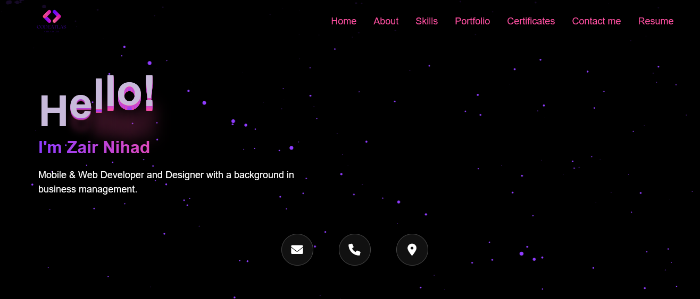
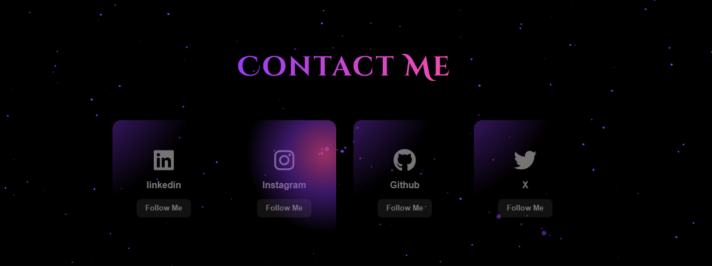

# 🚀 Portfolio V2 – Nihad Zair

A modern, responsive personal portfolio website created to showcase my web development skills, creative projects, and professional profile.

🔗 **Live Website:**  
https://nihad183.github.io/portfolio-V2/

---

##  Key Features

- Modern and clean UI design  
- Fully responsive on all devices (mobile, tablet, desktop)  
- Smooth animations and transitions  
- Multiple sections: About, Skills, Services, Portfolio, Contact  
- Optimized for performance and user experience  

---

##  Technologies Used

- HTML5  
- CSS3  
-  JavaScript  

---

##  Preview

---

##  Purpose of This Project

This portfolio was created to:
- Present my professional profile online  
- Showcase my web development projects  
- Demonstrate my front-end skills  
- Build a strong online presence for job opportunities and freelance work  

---

##  Author

- **Name:** Nihad Zair  
- **Portfolio:** https://nihad183.github.io/portfolio-V2/  
- **GitHub:** https://github.com/nihad183  

---

##  Contact

You can reach me through the contact form on my website or directly via GitHub.

---

                                     ⭐ If you like this project, don’t forget to give it a star! ⭐ 

